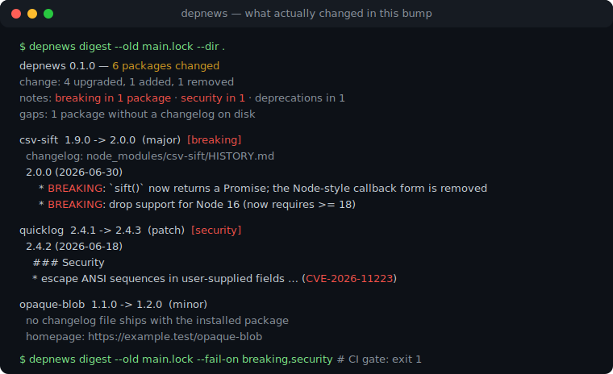
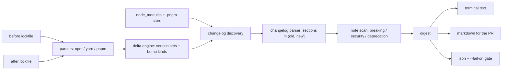

# depnews

[English](README.md) | [中文](README.zh.md) | [日本語](README.ja.md)

[](LICENSE)   [](CONTRIBUTING.md)

**depnews は lockfile diff で動いたすべてのパッケージの changelog をダイジェスト化。node_modules 内のファイルを直接読む — API 呼び出しなし、bot なし。**



```bash
# not yet on npm — install from a checkout of this repository
npm install && npm run build && npm pack
npm install -g ./depnews-0.1.0.tgz
```

## なぜ depnews？

依存関係のバンプは読まれないままマージされがちです。lockfile diff はハッシュの壁、bot が貼る「リリースノート」は GitHub アプリの導入と API クォータが必要、各パッケージの changelog を手で探すのはレビュー本体より時間がかかる — こうして昇格 PR は形式的に承認され、いつか本番を壊します。depnews の出発点は違います：**changelog はすでにあなたのディスク上にある。** ほとんどのパッケージはインストールした tarball に `CHANGELOG.md`/`HISTORY.md` を同梱しています。depnews は 2 つの lockfile（npm・yarn・pnpm、混在も可）を比較し、変更された各パッケージの changelog を `node_modules` から見つけ、`(old, new]` 区間のリリースセクションだけを抽出し、破壊的変更・セキュリティ修正（CVE/GHSA 番号）・非推奨化を行番号付きでフラグします。オフラインで決定的、changelog が無いパッケージには正直にその旨を伝えます。

|  | depnews | Dependabot リリースノート | Renovate changelogs | npm outdated |
|---|---|---|---|---|
| オフライン / 隔離環境で動く | はい | いいえ（ホスト型サービス） | いいえ（registry + GitHub API） | いいえ（registry 照会） |
| リポジトリに bot / アプリが必要 | 不要 | 必要 | 必要 | 不要 |
| 情報源 | ディスク上のインストール済み changelog ファイル | GitHub releases API | GitHub / registry API | registry メタデータ |
| 実際の lockfile 差分に対応（推移的依存含む） | はい | PR ごとの直接バンプ | PR ごとの直接バンプ | 直接依存のみ |
| 破壊的 / セキュリティ / 非推奨行のフラグ | はい、行番号付き | いいえ | 部分的 | いいえ |
| CI ゲート + 機械可読出力 | `--fail-on` で exit 1、安定 JSON | なし | なし | 終了コードのみ |
| ランタイム依存 | 0 | ホスト型サービス | Node アプリ、依存多数 | npm に同梱 |

<sub>各機能の主張は各プロジェクトの公開ドキュメントに照らして確認済み、2026-07。</sub>

## 機能

- **実際に届いたものを読む** — ダイジェストの出典はインストール済みパッケージ内の changelog であり、registry や API が主張するリリース内容ではありません。
- **lockfile 差分に紐づく** — npm lockfileVersion 1/2/3、yarn クラシックと Berry、pnpm v5-9 のキー文法に対応。ネストした重複はバージョン集合に畳み込まれ、diff の両側で形式が違っても動きます。
- **マージしようとしている区間だけ** — `(old, new]` のリリースセクションを新しい順に。ダウングレードはロールバックされるセクションを表示、追加パッケージは自身のエントリのみ。
- **破壊的/セキュリティ/非推奨フラグ** — 実ファイル行番号付きのキーワードスキャン。表示の切り詰め*前*に全文を走査するため、上限が破壊的変更を隠すことはありません。
- **3 種類の出力と CI ゲート** — ターミナルテキスト、PR にそのまま貼れる Markdown（サマリ表 + 見出しを降格したセクション）、キー順の安定した JSON。`--fail-on breaking,security` は CI で exit 1。
- **ランタイム依存ゼロ、完全オフライン** — 必要なのは Node.js だけ。ソケットを一切開かず、devDependency は `typescript` のみです。

## クイックスタート

インストール：

```bash
# not yet on npm — install from a checkout of this repository
npm install && npm run build && npm pack
npm install -g ./depnews-0.1.0.tgz
```

同梱サンプルのバンプをダイジェスト（リポジトリのルートで）：

```bash
depnews digest --old examples/before.lock.json --dir examples/project --modules examples/project/installed
```

出力（実際の実行結果。一部エントリは省略）：

```text
depnews 0.1.0 — 6 packages changed
before: examples/before.lock.json (npm, 6 packages)
after:  examples/project/package-lock.json (npm, 6 packages)
change: 4 upgraded, 1 added, 1 removed
notes:  breaking in 1 package · security in 1 · deprecations in 1
gaps:   1 package without a changelog on disk

csv-sift  1.9.0 -> 2.0.0  (major)  [breaking]
  changelog: examples/project/installed/csv-sift/HISTORY.md

  2.0.0 (2026-06-30)
      * BREAKING: `sift()` now returns a Promise; the Node-style callback form is removed
      * BREAKING: drop support for Node 16 (now requires >= 18)
      * parse quoted CRLF fields 2.1x faster on the large-file benchmark

opaque-blob  1.1.0 -> 1.2.0  (minor)
  no changelog file ships with the installed package
  homepage: https://example.test/opaque-blob

quicklog  2.4.1 -> 2.4.3  (patch)  [security]
  changelog: examples/project/installed/quicklog/CHANGELOG.md

  2.4.3 (2026-07-01)
    * fix: flush buffered lines when the process exits mid-write

  2.4.2 (2026-06-18)
    ### Security

    * escape ANSI sequences in user-supplied fields before terminal output (CVE-2026-11223); untrusted log fields could previously rewrite the visible scrollback

tinydate  removed (was 1.0.0)
```

実際のアップグレードブランチでは、ベースの lockfile を git から直接パイプ — 一時ファイル不要、ネットワークも不要：

```bash
git show origin/main:package-lock.json | depnews digest --old -
git show origin/main:package-lock.json | depnews digest --old - --format markdown  # paste into the PR
git show origin/main:package-lock.json | depnews digest --old - --fail-on breaking,security
```

ゲートは理由を出力して exit 1 で終了します（実際の実行結果）：

```text
depnews: --fail-on triggered: breaking (1 package), security (1 package)
```

## CLI リファレンス

3 つのサブコマンドが同じオプション体系を共有します：`digest`（完全レポート）、`diff`（バージョン表のみ）、`changelog <pkg>`（インストール済みパッケージ 1 つの抽出区間）。

| キー | デフォルト | 効果 |
|---|---|---|
| `--old <path>` | （必須） | 変更前の lockfile。`-` で stdin から読む |
| `--new <path>` | `--dir` 内で自動検出 | 変更後の lockfile |
| `--dir <path>` | `.` | プロジェクトディレクトリ |
| `--modules <path>` | 変更後 lockfile の隣 | 探索する node_modules ルート。繰り返し可 |
| `--format <fmt>` | `text` | `text`・`markdown`・`json` |
| `--only` / `--exclude` | — | カンマ区切りの名前。`@scope/*` 前綴も可 |
| `--max-lines` / `--max-releases` | 40 / 20 | リリース本文ごと / パッケージごとの表示上限 |
| `--fail-on <kinds>` | — | `breaking,security,deprecation,major,downgrade` の任意組み合わせ -> exit 1 |

終了コードは安定 API です：`0` 正常、`1` `--fail-on` 条件の発火、`2` 用法/設定/IO エラー — スクリプトは「レビュー上の発見」と「壊れた呼び出し」を区別できます。対応する lockfile 方言、changelog 見出しの形、探索の優先順位、フラグのキーワードはすべて [docs/formats.md](docs/formats.md) に明記しています。

## アーキテクチャ



## ロードマップ

- [x] lockfile 差分（npm/yarn/pnpm、形式混在可）+ インストール済み changelog のダイジェスト。破壊的/セキュリティ/非推奨フラグ、3 種のレンダラー、CI ゲート、動くサンプル付き（v0.1.0）
- [ ] changelog を同梱する他のエコシステム：Cargo.lock + `~/.cargo` レジストリキャッシュ、poetry.lock + site-packages
- [ ] `--old git:<ref>` 簡易記法（ローカルで `git show` を呼ぶだけ、ネットワークは使わない）
- [ ] Monorepo モード：変更パッケージを取り込む workspace ごとにダイジェストをグループ化
- [ ] changelog の無いパッケージ向けに GitHub リリースノート風の*ローカルファイル*（`.github/release.yml` 形式）をサポート

全リストは [open issues](https://github.com/JaydenCJ/depnews/issues) を参照。

## コントリビュート

コントリビュート歓迎です。`npm install && npm run build` でビルドし、`npm test`（90 テスト）と `bash scripts/smoke.sh`（`SMOKE OK` を出力すること）を実行してください — このリポジトリは CI を持たず、上記の主張はすべてローカル実行で検証されています。[CONTRIBUTING.md](CONTRIBUTING.md) を読み、[good first issue](https://github.com/JaydenCJ/depnews/issues?q=is%3Aissue+is%3Aopen+label%3A%22good+first+issue%22) を選ぶか、[discussion](https://github.com/JaydenCJ/depnews/discussions) を始めてください。

## ライセンス

[MIT](LICENSE)
