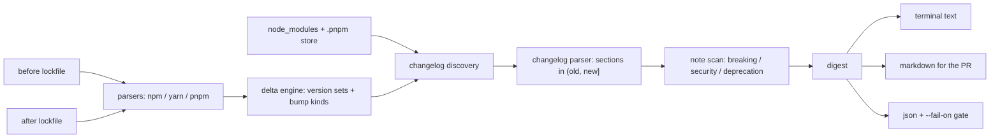

# depnews

[English](README.md) | [中文](README.zh.md) | [日本語](README.ja.md)

[](LICENSE)   [](CONTRIBUTING.md)

**depnews digests the changelogs of every package that moved in your lockfile diff, read straight from node_modules — no API calls, no bot.**


```bash
# not yet on npm — install from a checkout of this repository
npm install && npm run build && npm pack
npm install -g ./depnews-0.1.0.tgz
```

## Why depnews?

Dependency bumps merge unread. The lockfile diff is a wall of hashes, the "release notes" a bot pastes need a GitHub app and an API quota, and hunting each package's changelog by hand takes longer than the review itself — so upgrades get rubber-stamped until one breaks production. depnews starts from a different observation: **the changelogs are already on your disk.** Most packages ship their `CHANGELOG.md`/`HISTORY.md` in the tarball you installed. depnews diffs two lockfiles (npm, yarn and pnpm — even mixed), finds each changed package's changelog under `node_modules`, extracts exactly the release sections in the `(old, new]` range, and flags breaking changes, security fixes (CVE/GHSA ids) and deprecations with file line numbers. Offline, deterministic, and honest when a package ships no changelog at all.

|  | depnews | Dependabot release notes | Renovate changelogs | npm outdated |
|---|---|---|---|---|
| Works offline / air-gapped | yes | no (hosted service) | no (registry + GitHub APIs) | no (registry call) |
| Needs a bot / app on the repo | no | yes | yes | no |
| Source of truth | changelog files installed on disk | GitHub releases API | GitHub / registry APIs | registry metadata |
| Keyed to the real lockfile delta (incl. transitive) | yes | direct bumps per PR | direct bumps per PR | direct deps only |
| Flags breaking / security / deprecation lines | yes, with line numbers | no | partial | no |
| CI gate + machine output | `--fail-on` exit 1, stable JSON | no | no | exit code only |
| Runtime dependencies | 0 | hosted service | Node app, many deps | ships with npm |

<sub>Capability claims checked against each project's public documentation, 2026-07.</sub>

## Features

- **Reads what actually shipped** — the digest comes from the changelog inside the installed package, not from whatever a registry or API says the release was.
- **Keyed to your lockfile delta** — npm lockfileVersion 1/2/3, yarn classic and Berry, pnpm v5-9 key grammars; nested duplicates collapse into version sets, and the two sides may even use different formats.
- **Exactly the range you're merging** — release sections in `(old, new]`, newest first; downgrades show the sections being rolled back; added packages show their own entry only.
- **Breaking/security/deprecation flags** — keyword scan with real file line numbers, run on full bodies *before* display truncation, so a cap can never hide a breaking change.
- **Three outputs and a CI gate** — terminal text, PR-ready Markdown (summary table + demoted sections), stable-keyed JSON; `--fail-on breaking,security` exits 1 in CI.
- **Zero runtime dependencies, fully offline** — Node.js is the only requirement; the tool never opens a socket, and `typescript` is the sole devDependency.

## Quickstart

Install:

```bash
# not yet on npm — install from a checkout of this repository
npm install && npm run build && npm pack
npm install -g ./depnews-0.1.0.tgz
```

Digest the bundled example bump (from the repo root):

```bash
depnews digest --old examples/before.lock.json --dir examples/project --modules examples/project/installed
```

Output (real captured run; some entries elided):

```text
depnews 0.1.0 — 6 packages changed
before: examples/before.lock.json (npm, 6 packages)
after:  examples/project/package-lock.json (npm, 6 packages)
change: 4 upgraded, 1 added, 1 removed
notes:  breaking in 1 package · security in 1 · deprecations in 1
gaps:   1 package without a changelog on disk

csv-sift  1.9.0 -> 2.0.0  (major)  [breaking]
  changelog: examples/project/installed/csv-sift/HISTORY.md

  2.0.0 (2026-06-30)
      * BREAKING: `sift()` now returns a Promise; the Node-style callback form is removed
      * BREAKING: drop support for Node 16 (now requires >= 18)
      * parse quoted CRLF fields 2.1x faster on the large-file benchmark

opaque-blob  1.1.0 -> 1.2.0  (minor)
  no changelog file ships with the installed package
  homepage: https://example.test/opaque-blob

quicklog  2.4.1 -> 2.4.3  (patch)  [security]
  changelog: examples/project/installed/quicklog/CHANGELOG.md

  2.4.3 (2026-07-01)
    * fix: flush buffered lines when the process exits mid-write

  2.4.2 (2026-06-18)
    ### Security

    * escape ANSI sequences in user-supplied fields before terminal output (CVE-2026-11223); untrusted log fields could previously rewrite the visible scrollback

tinydate  removed (was 1.0.0)
```

On a real upgrade branch, pipe the base lockfile straight out of git — no temp files, still no network:

```bash
git show origin/main:package-lock.json | depnews digest --old -
git show origin/main:package-lock.json | depnews digest --old - --format markdown  # paste into the PR
git show origin/main:package-lock.json | depnews digest --old - --fail-on breaking,security
```

The gate prints its reason and exits 1 (real captured run):

```text
depnews: --fail-on triggered: breaking (1 package), security (1 package)
```

## CLI reference

Three subcommands share one option vocabulary: `digest` (the full report), `diff` (just the version table) and `changelog <pkg>` (one installed package's extracted range).

| Key | Default | Effect |
|---|---|---|
| `--old <path>` | (required) | before lockfile; `-` reads it from stdin |
| `--new <path>` | auto-detected in `--dir` | after lockfile |
| `--dir <path>` | `.` | project directory |
| `--modules <path>` | next to the after lockfile | node_modules root to search; repeatable |
| `--format <fmt>` | `text` | `text`, `markdown`, `json` |
| `--only` / `--exclude` | — | comma-separated names; `@scope/*` prefixes allowed |
| `--max-lines` / `--max-releases` | 40 / 20 | display caps per release body / per package |
| `--fail-on <kinds>` | — | any of `breaking,security,deprecation,major,downgrade` -> exit 1 |

Exit codes are stable API: `0` ok, `1` a `--fail-on` condition triggered, `2` usage/config/IO error — so scripts can tell a review finding from a broken invocation. Supported lockfile dialects, changelog heading shapes, discovery ranking and flag keywords are all specified in [docs/formats.md](docs/formats.md).

## Architecture



## Roadmap

- [x] Lockfile diff (npm/yarn/pnpm, cross-format) + installed-changelog digest with breaking/security/deprecation flags, three renderers, CI gate, worked examples (v0.1.0)
- [ ] More ecosystems that vendor changelogs: Cargo.lock + `~/.cargo` registry cache, poetry.lock + site-packages
- [ ] `--old git:<ref>` convenience (shell out to `git show` locally, still no network)
- [ ] Monorepo mode: group the digest per workspace that pulls the changed package
- [ ] GitHub-release-notes fallback *file* support (`.github/release.yml` style) for packages that ship none

See the [open issues](https://github.com/JaydenCJ/depnews/issues) for the full list.

## Contributing

Contributions are welcome. Build with `npm install && npm run build`, then run `npm test` (90 tests) and `bash scripts/smoke.sh` (must print `SMOKE OK`) — this repository ships no CI, every claim above is verified by local runs. See [CONTRIBUTING.md](CONTRIBUTING.md), grab a [good first issue](https://github.com/JaydenCJ/depnews/issues?q=is%3Aissue+is%3Aopen+label%3A%22good+first+issue%22), or start a [discussion](https://github.com/JaydenCJ/depnews/discussions).

## License

[MIT](LICENSE)
