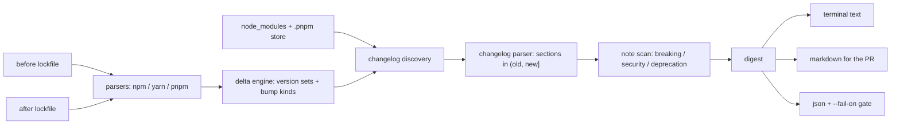

# depnews

[English](README.md) | [中文](README.zh.md) | [日本語](README.ja.md)

[](LICENSE)   [](CONTRIBUTING.md)

**depnews 把 lockfile diff 中每个变动包的 changelog 汇总成一份摘要，直接读取 node_modules 里的文件 — 不调 API、不装 bot。**


```bash
# not yet on npm — install from a checkout of this repository
npm install && npm run build && npm pack
npm install -g ./depnews-0.1.0.tgz
```

## 为什么选 depnews？

依赖升级常常没人读就合并了。lockfile diff 是一面哈希墙，bot 贴的"发布说明"要装 GitHub 应用还占 API 配额，逐个包手动翻 changelog 比评审本身还耗时 — 于是升级 PR 被例行盖章，直到某一次把生产环境搞挂。depnews 的出发点不同：**changelog 早就在你的磁盘上了。** 大多数包都会把 `CHANGELOG.md`/`HISTORY.md` 打进你安装的 tarball。depnews 对比两份 lockfile（npm、yarn、pnpm，甚至可以混用），在 `node_modules` 里找到每个变动包的 changelog，精确抽取 `(old, new]` 区间内的发布小节，并带文件行号标记破坏性变更、安全修复（CVE/GHSA 编号）和废弃提示。离线、确定性输出，包没带 changelog 时也如实说明。

|  | depnews | Dependabot 发布说明 | Renovate changelogs | npm outdated |
|---|---|---|---|---|
| 离线 / 隔离网络可用 | 可以 | 不行（托管服务） | 不行（registry + GitHub API） | 不行（要查 registry） |
| 需要在仓库装 bot / 应用 | 不需要 | 需要 | 需要 | 不需要 |
| 信息来源 | 磁盘上已安装的 changelog 文件 | GitHub releases API | GitHub / registry API | registry 元数据 |
| 对齐真实 lockfile 差异（含传递依赖） | 是 | 每个 PR 的直接升级 | 每个 PR 的直接升级 | 仅直接依赖 |
| 标记破坏性 / 安全 / 废弃行 | 是，带行号 | 否 | 部分 | 否 |
| CI 门禁 + 机器可读输出 | `--fail-on` 退出码 1，稳定 JSON | 无 | 无 | 仅退出码 |
| 运行时依赖 | 0 | 托管服务 | Node 应用，依赖众多 | 随 npm 附带 |

<sub>各项能力均已对照相应项目的公开文档核实，2026-07。</sub>

## 功能特性

- **读真正装进来的东西** — 摘要来自已安装包内部的 changelog，而不是 registry 或 API 声称的发布内容。
- **对齐你的 lockfile 差异** — 支持 npm lockfileVersion 1/2/3、yarn 经典版与 Berry、pnpm v5-9 键名语法；嵌套重复版本合并为版本集合，diff 两侧甚至可以是不同格式。
- **只看你正要合并的区间** — `(old, new]` 内的发布小节，最新在前；降级会展示被回滚的小节；新增包只展示它自己的条目。
- **破坏性/安全/废弃标记** — 关键词扫描带真实文件行号，且在展示截断*之前*扫完整正文，截断上限永远不会藏住一个破坏性变更。
- **三种输出加一道 CI 门禁** — 终端文本、可直接贴 PR 的 Markdown（汇总表 + 降级标题的小节）、键序稳定的 JSON；`--fail-on breaking,security` 在 CI 中以退出码 1 拦截。
- **零运行时依赖，完全离线** — 只需要 Node.js；工具从不打开任何 socket，`typescript` 是唯一的 devDependency。

## 快速上手

安装：

```bash
# not yet on npm — install from a checkout of this repository
npm install && npm run build && npm pack
npm install -g ./depnews-0.1.0.tgz
```

对内置示例升级做一次摘要（在仓库根目录）：

```bash
depnews digest --old examples/before.lock.json --dir examples/project --modules examples/project/installed
```

输出（真实运行记录；省略了部分条目）：

```text
depnews 0.1.0 — 6 packages changed
before: examples/before.lock.json (npm, 6 packages)
after:  examples/project/package-lock.json (npm, 6 packages)
change: 4 upgraded, 1 added, 1 removed
notes:  breaking in 1 package · security in 1 · deprecations in 1
gaps:   1 package without a changelog on disk

csv-sift  1.9.0 -> 2.0.0  (major)  [breaking]
  changelog: examples/project/installed/csv-sift/HISTORY.md

  2.0.0 (2026-06-30)
      * BREAKING: `sift()` now returns a Promise; the Node-style callback form is removed
      * BREAKING: drop support for Node 16 (now requires >= 18)
      * parse quoted CRLF fields 2.1x faster on the large-file benchmark

opaque-blob  1.1.0 -> 1.2.0  (minor)
  no changelog file ships with the installed package
  homepage: https://example.test/opaque-blob

quicklog  2.4.1 -> 2.4.3  (patch)  [security]
  changelog: examples/project/installed/quicklog/CHANGELOG.md

  2.4.3 (2026-07-01)
    * fix: flush buffered lines when the process exits mid-write

  2.4.2 (2026-06-18)
    ### Security

    * escape ANSI sequences in user-supplied fields before terminal output (CVE-2026-11223); untrusted log fields could previously rewrite the visible scrollback

tinydate  removed (was 1.0.0)
```

在真实的升级分支上，直接从 git 管道取基线 lockfile — 不落临时文件，依旧不联网：

```bash
git show origin/main:package-lock.json | depnews digest --old -
git show origin/main:package-lock.json | depnews digest --old - --format markdown  # paste into the PR
git show origin/main:package-lock.json | depnews digest --old - --fail-on breaking,security
```

门禁会打印原因并以退出码 1 结束（真实运行记录）：

```text
depnews: --fail-on triggered: breaking (1 package), security (1 package)
```

## CLI 参考

三个子命令共用同一套选项：`digest`（完整报告）、`diff`（只看版本表）、`changelog <pkg>`（抽取某个已安装包的发布区间）。

| 选项 | 默认值 | 作用 |
|---|---|---|
| `--old <path>` | （必填） | 变更前的 lockfile；`-` 表示从 stdin 读取 |
| `--new <path>` | 在 `--dir` 中自动探测 | 变更后的 lockfile |
| `--dir <path>` | `.` | 项目目录 |
| `--modules <path>` | 变更后 lockfile 旁边 | 要搜索的 node_modules 根目录；可重复 |
| `--format <fmt>` | `text` | `text`、`markdown`、`json` |
| `--only` / `--exclude` | — | 逗号分隔的包名；支持 `@scope/*` 前缀 |
| `--max-lines` / `--max-releases` | 40 / 20 | 每个发布正文 / 每个包的展示上限 |
| `--fail-on <kinds>` | — | `breaking,security,deprecation,major,downgrade` 任意组合 -> 退出码 1 |

退出码是稳定 API：`0` 正常、`1` 触发 `--fail-on` 条件、`2` 用法/配置/IO 错误 — 脚本因此能区分"评审发现"与"命令写错"。支持的 lockfile 方言、changelog 标题形态、发现排序和标记关键词全部写在 [docs/formats.md](docs/formats.md)。

## 架构



## 路线图

- [x] lockfile 差异（npm/yarn/pnpm，可跨格式）+ 已安装 changelog 摘要，含破坏性/安全/废弃标记、三种渲染器、CI 门禁、完整示例（v0.1.0）
- [ ] 更多自带 changelog 的生态：Cargo.lock + `~/.cargo` registry 缓存、poetry.lock + site-packages
- [ ] `--old git:<ref>` 便捷写法（本地调用 `git show`，依旧不联网）
- [ ] Monorepo 模式：按引入变动包的 workspace 分组输出摘要
- [ ] 对不带 changelog 的包支持 GitHub 发布说明式的*本地文件*（`.github/release.yml` 风格）

完整列表见 [open issues](https://github.com/JaydenCJ/depnews/issues)。

## 参与贡献

欢迎贡献。先 `npm install && npm run build` 构建，然后运行 `npm test`（90 个测试）和 `bash scripts/smoke.sh`（必须打印 `SMOKE OK`）— 本仓库不带 CI，上面的每一条声明都由本地运行验证。参见 [CONTRIBUTING.md](CONTRIBUTING.md)，领一个 [good first issue](https://github.com/JaydenCJ/depnews/issues?q=is%3Aissue+is%3Aopen+label%3A%22good+first+issue%22)，或发起一场 [discussion](https://github.com/JaydenCJ/depnews/discussions)。

## 许可证

[MIT](LICENSE)
